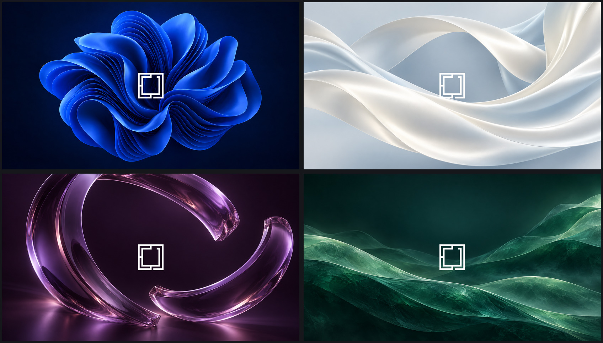

# Familiar

<p>
  <a href="https://github.com/tcballard/omarchy-badges"></a>
  
  
</p>

A Windows-inspired light theme for Omarchy Quattro: clean application surfaces, a charcoal bar, blue selections and four original wallpapers with the official Omarchy logo.



Clockwise from top left: Blue Bloom, Pearl Silk, Aurora Tides and Violet Orbit. These change the wallpaper; the application palette remains the Familiar light theme.

## Install

**Tested installed Omarchy version: none yet.** Quattro is the source target, not a verified installed-version compatibility claim. The category badge is a community label, not certification.

Development preview targeting Quattro. Record your current theme and background before installation:

```sh
cat "$HOME/.local/state/omarchy/current/theme.name"
readlink -f "$HOME/.local/state/omarchy/current/background"
omarchy theme install https://github.com/tcballard/omarchy-theme-familiar
```

The installer applies the theme immediately and may replace an existing copy. This repository name produces the installed theme name **theme-familiar**. Select a wallpaper with Omarchy's background picker.

To restore your previous theme, run `omarchy-theme-set "PREVIOUS THEME NAME"`, substituting the recorded name, then select the previous wallpaper if needed.

## Optional familiar desktop layout

The theme alone changes colours, typography and bar size. The optional preset moves the bar to the bottom, puts the Omarchy menu and open-window buttons on the left, and keeps clock/system controls on the right. It preserves extra widgets and unrelated settings.

From a checkout of this repository:

```sh
bash optional/familiar-preset plan
bash optional/familiar-preset apply
# Undo the layout:
bash optional/familiar-preset restore
```

Requires Quattro's running shell, Bash, jq and flock. The plan is read-only. Apply installs the included task widget and saves your previous bar configuration. Restore refuses to overwrite later bar edits and retains unrelated setting changes. Widget files remain installed but inactive after restoration. Snapshots live under `${XDG_STATE_HOME:-$HOME/.local/state}/familiar-preset`. Keep this checkout for rollback. If Omarchy uses a nonstandard installation directory, set OMARCHY_PATH accordingly.

This is not a Windows shell replacement: there are no added title-bar buttons, pinned applications, minimize-to-taskbar, desktop icons or Windows snap behaviour. The menu remains Omarchy's menu, with normal Omarchy tiling and shortcuts. Application-provided window controls remain in use.

## Softer appearance

The theme adds consistent 4/8px spacing, 36px control rows and quieter menu/control outlines. Blue selections and keyboard-focus indicators remain distinct.

An independent part of the optional preset adds **5px window borders, 12px rounded corners, gentle window shadows, 8px inner gaps and 16px outer gaps**. Familiar uses a solid blue active-window border and a muted grey inactive border, making focus clear even on the light wallpapers. Quattro's shared shell surfaces follow Hyprland's corner radius. You can use this with or without the bottom-bar layout:

```sh
bash optional/familiar-preset appearance plan
bash optional/familiar-preset appearance apply
hyprctl configerrors
# Undo only the appearance settings:
bash optional/familiar-preset appearance restore
```

Run from this checkout inside your Hyprland session. Requires Python 3, `hyprctl` and Quattro's `~/.config/hypr/hyprland.lua`; older `.conf` configurations are not modified. Apply installs `~/.config/hypr/familiar-appearance.lua` and appends a marked include to your existing configuration. Animation preferences, focus colours and bar placement are preserved.

**Appearance stays active when switching themes until you restore it.** Layout and appearance have independent apply/restore commands. Restoration removes only the managed include and unedited appearance file, preserving other configuration edits. Conflicting edits cause refusal with the recovery snapshot location (`${XDG_STATE_HOME:-$HOME/.local/state}/familiar-appearance`). A failed reload retains that snapshot. See [the XPS verification steps](docs/APPEARANCE.md) before treating this as desktop-tested.

If you already applied an earlier appearance preset, run `bash optional/familiar-preset appearance restore` and then `bash optional/familiar-preset appearance apply` after updating to install the new border width. Reapply the Familiar theme to regenerate its border colours.

## Status

Built against Quattro commit b679363bed05415771a1b1dc92c6899a908236f7. The correction audit reproduced TOML parsing, text contrast, all 19 retained upstream template-generation checks, all five section overrides, image decoding and isolated preset checks. The earlier Rust-helper and mocked-QML checks were not rerun in this audit. Live desktop, display scaling, compositor activation and registry validation remain unverified. See [validation evidence](docs/VALIDATION.md).

Six complete shell-section overrides customise bar, font, controls, launcher, menu and spacing; revisit these when upstream adds section settings. Other applications derive colours through Omarchy's templates. User templates may take precedence.

Artwork provenance and official logo source: [CREDITS.md](CREDITS.md). No Microsoft wallpaper files are included. Not affiliated with Microsoft. This preview has not been submitted to the theme registry; no fabricated desktop screenshot is provided.
