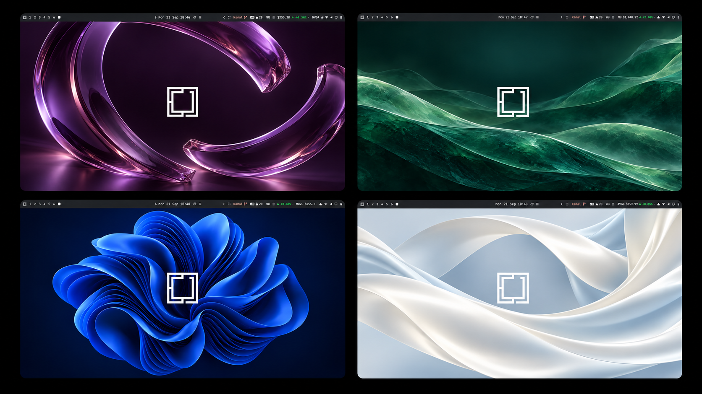

# Familiar

[](https://github.com/tcballard/omarchy-badges)

**A little Windows familiarity for your Omarchy desktop.**

Familiar brings a light palette, a charcoal bar and clear blue accents to Omarchy Quattro. Four wallpapers give it a different mood, from a blue folded bloom to purple glass, green waves and flowing white silk.

Built and tested on my Dell XPS running Omarchy. The preview below brings together screenshots from that machine.



## Try it

```sh
omarchy theme install https://github.com/tcballard/omarchy-theme-familiar
```

The installer applies Familiar immediately. Pick your favourite wallpaper with Omarchy’s background picker, or switch back through the theme picker.

## Make yourself at home

The theme gives you light surfaces, blue selections and a clear active-window colour. The four wallpapers share the same application palette.

There are also optional presets for a bottom bar with open-window buttons, and for rounded corners, shadows and thicker window borders. These are separate from the theme install. The appearance preset now applies only while Familiar is selected; switching themes restores their normal geometry. The bottom-bar layout stays active until you restore it. Existing appearance-preset users should follow the upgrade steps in the appearance guide. See the [appearance guide](docs/APPEARANCE.md) and [preset commands](optional/familiar-preset).

Found something hard to read or out of place? [Open an issue](https://github.com/tcballard/omarchy-theme-familiar/issues) with a screenshot.

## Marketplace

[Submitted to the Omarchy Theme Registry](https://github.com/omacom/omarchy-theme-registry/issues/44). Registry validation has passed; the listing is awaiting maintainer approval.

## Credits and licence

[MIT](LICENSE) © 2026 Tom Ballard. [Artwork, logo and design credits](CREDITS.md).
